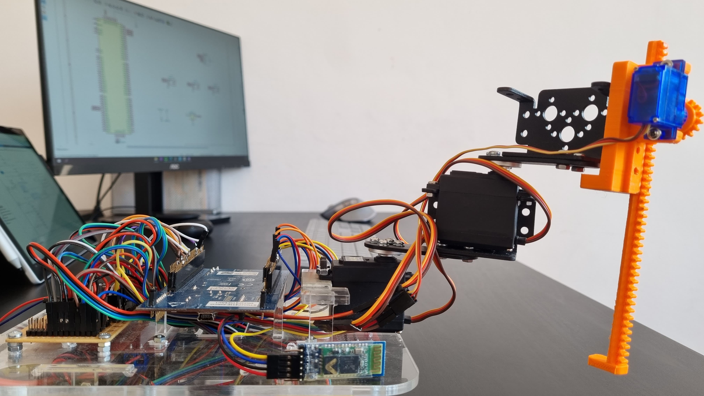
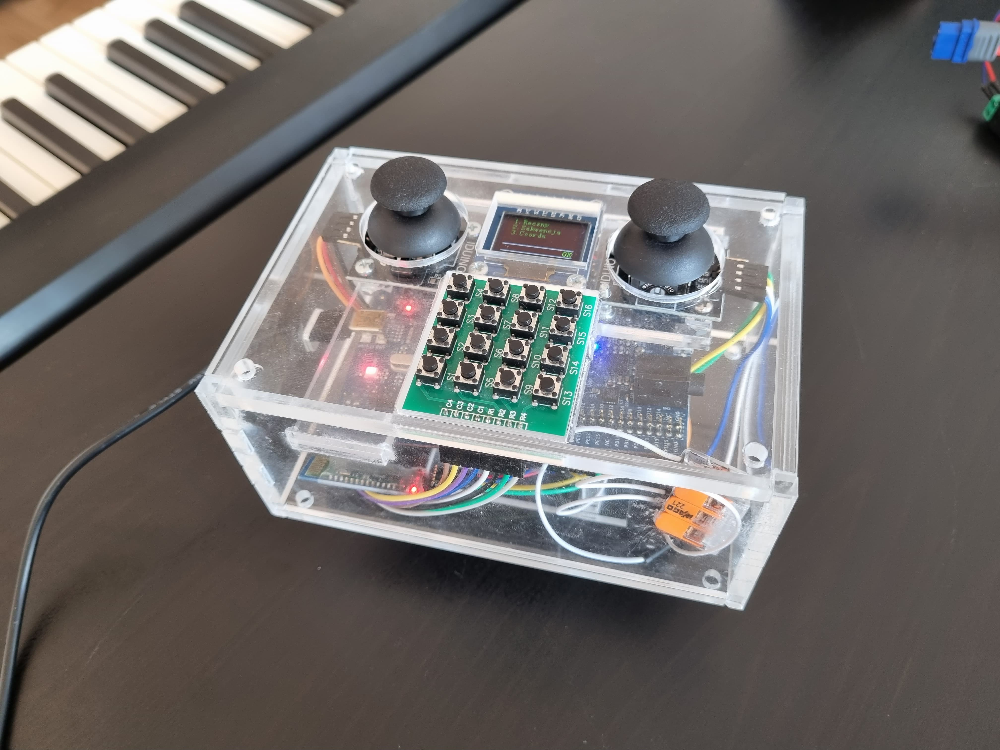

# Manipulator RRT
Projekt wykonany na zajęcia projektowe Sterowników Robotów na Politechnice Wrocławskiej

# Opis projektu
Założeniem projektu jest budowa oraz oprogramowanie manipulatora RRT i zaprojektowanie interfejsu
dla operatora.
## Opis funkcjonalności robota i pilota:
- [X] Konstrukcja samego manipulatora będzie wykonana z gotowych aluminiowych elementów wykona-
nych pod serwomechanizmy, takich jak uchwyty, mocowania, orczyki i wydrukowanego elementu,
który jest odpowiedzialny za ruch translacyjny manipulatora.
- [X] Jako punkt pracy manipulatora wykorzystano mały elektromagnez, odpowiedzialny za przenoszenie
małych metalowych elementów.
- [X] Do sterowania manipulatora zostanie wykorzystana odwrotna kinematyka oraz joysticki, które będą
umieszone na pilocie operatorskim.
- [X] Pilot operatorski, dzięki wyświetlaczowi OLED, daje możliwość wglądu do najważniejszych infor-
macji tj. informacja zwrotna na temat położenia punktu pracy manipulatora czy kąt rotacji każdego
z przegubów. Jednak jego główną rolą jest sterowanie położeniem samego ramienia.
- [X] Współrzędne ustawione przez użytkownika będzie można można zapisywać do sekwencji, a następnie
ją odtwarzać. Wszystkie sekwencje będą zapisywane do pamięci FLASH lub EEPROM.
- [X] Dane do współrzędnych będą wprowadzane za pomocą klawiatury matrycowej lub przy pomocy
joysticków.
- [X] Do kominikacji między płytką odpowiedzialną za obsługę manipulatora i tą na pilocie wykorzystano
moduł Bluetooth 4.0

